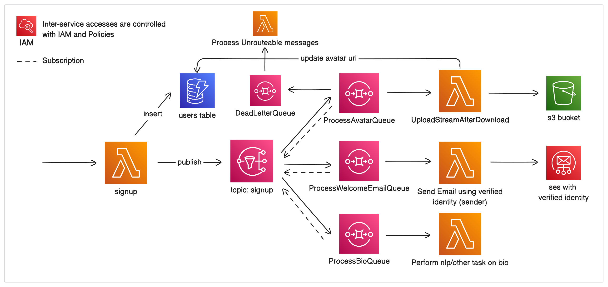

<h3 align="center">serverless-localstack-aws</h3>

---

<p align="center"> Infrastructure as Code using Serverless Framework (TypeScript). Demonstration of how to integrate Lambda, Dynamodb, SNS, SQS, SES, S3, IAM and deploy (test) without any AWS account.
    <br> 
</p>

## 📝 Table of Contents

- [About](#about)
- [Architecture](#architecture)
- [Getting Started](#getting_started)
- [Usage](#usage)
- [Built Using](#built_using)
- [Authors](#authors)

## 🧐 About <a name = "about"></a>
This project demonstrates how one can build and test application locally for cloud (AWS). Through this project, you may find reference on how to build a Registration flow using Pub/Sub architecture. You nay learn how to integrate Lambda, Dynamodb, SNS, SQS, SES, S3, IAM together using Serverless Framework (TypeScript). And most importantly you will see how to test and deploy locally without having an AWS account using Localstack.

### Scenario
A user signs up using social login. Frontend collects the user's name, email, bio, and temporary avatar_url and invokes the SignUp Lambda with those data. SignUp Lambda registers the user and publishes a topic to SNS. Then other Lambdas that were listening to SQS queues which were subscribed to that SNS topic get invoked and do their work. One Lambda processes the bio, one sends a welcome email, and the remaining one downloads the avatar from the temporary link and uploads to S3 to obtain a permanent link.

## 🧩 Architecture <a name = "architecture"></a>


## 🏁 Getting Started <a name = "getting_started"></a>

These instructions will get you a copy of the project up and running on your local machine for development and testing purposes. See [usage](#usage) for how you can see everything in action and interact with the system. 

### Prerequisites

What things you need to run the application

```
node v19.8.1
pnpm v8.6.0
```
```
docker-compose v2.10.2
```

### Installing

A step by step series of examples that tell you how to get a development env running.

Clone this repository

```
git clone https://github.com/theZeuses/serverless-localstack-aws.git
```

Change working directory

```
cd serverless-localstack-aws
```

Create a .env file in root and copy everything form .env.example

```
cat .env.example > .env
```

Install the dependencies

```
pnpm i
```

Spin up the docker service for localstack

```
docker-compose up -d
```

Create a Email Identity using Localhost Dashboard from

```
https://app.localstack.cloud/resources/ses/v1/identities/:id/new
```
>The Identity email must be same as EMAIL_FROM value of .env

> You will have to create a account for the first time. You will be able to monitor all the local AWS services using this Dashbaord

Deploy the application to the local AWS

```
npx serverless deploy --stage local
```

> After successful deployment you will see an endpoint. ***Carefully note down the url as this will be needed to invoke the SignUp Lamda function.***

## 🎈 Usage <a name="usage"></a>
### Action
To see the application in action you have to invoke the endpoint that you collected from the last step. Use curl/postman/insomnia to make a ***POST*** request to **that_url/signup**. Example
```
POST http://localhost:4566/restapis/dd9c1qsoh2/local/_user_request_/signup
```
BODY
```
{
	"email": "test@test.com",
	"name": "test",
	"bio": "test",
	"avatar": "https://cdn.pixabay.com/photo/2015/09/16/08/55/online-942406_1280.jpg"
}
```

### Result
Now, if you navigate to 
```
https://app.localstack.cloud/resources/ses/v1
```

You will find the identity you created earlier. Clicking that will display the welcome email sent to the user's email.

And to view the uploaded avatar you have to go to
```
https://app.localstack.cloud/resources/s3/hellish-train
```

## ⛏️ Built Using <a name = "built_using"></a>

- [AWS](https://aws.amazon.com/) - Cloud Provider
- [Serverless Framework](https://www.serverless.com/) - IaC Framework
- [NodeJs](https://nodejs.org/en/) - Server Environment
- [Localstack](https://localstack.cloud/) - Local Deployment Service Provider

## ✍️ Authors <a name = "authors"></a>

- [@theZeuses](https://github.com/theZeuses) - Idea & Initial work